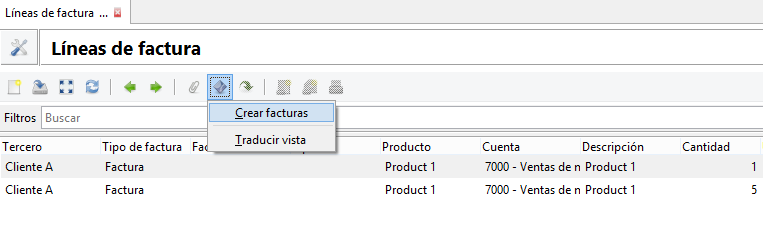

=================================================
Creación de factura a partir de líneas de factura
=================================================

El módulo **account_invoice_line_stand2invoice** es un complemento del módulo
`Facturación de líneas de factura`_.

.. _Facturación de líneas de factura: ../account_invoice_line_standalone/index.html

Añade un asistente a la vista de líneas de factura: |menu_account_invoice_line|,
que permite la creación de una factura de una forma rápida, a partir de una
serie de líneas seleccionadas previamente.

.. |menu_account_invoice_line| tryref:: account_invoice_line_standalone.menu_invoice_line_out_invoice_form/complete_name

.. tip:: Sólo podrá seleccionar líneas de factura de un mismo tercero que no
         estén facturadas previamente.

Módulos de los que depende
==========================

Instalados
----------

.. toctree::
   :maxdepth: 1

   /account_invoice_data/index
   /account_invoice_line_standalone/index

Dependencias
------------

* `Datos de Facturación`_
* `Facturación de líneas de factura`_

.. _Datos de Facturación: ../account_invoice_data/index.html
.. _Facturación de líneas de factura: ../account_invoice_line_standalone/index.html
